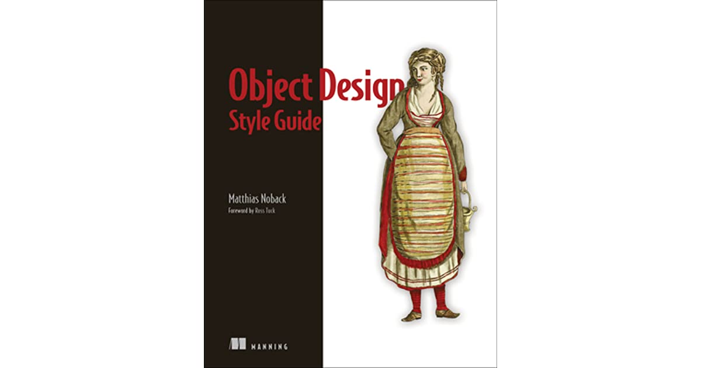

# Object Design Style Guide

---

> My Notes on book "Object Design Style Guide"

### Chapters

1. [Programming with Objects](./programming-with-objects/readme.md)
2. [Creating Services](./creating-services/readme.md)
3. [Creating Other Objects](./creating-other-objects/readme.md)
4. [Manipulating Objects](./manipulating-objects/readme.md)
5. [Using Objects](./using-objects/readme.md)
6. [Retrieving Information](./retrieving-information/readme.md)
7. [Performing Tasks](./performing-tasks/readme.md)
8. [Dividing Responsibilities](./dividing-responsibilities/readme.md)
9. [Changing Behavior of Services](./changing-behavior-of-services/readme.md)
10. [A Field guide to Objects](./field-guide-to-objects/readme.md)
11. [Epilogue](./epilogue/readme.md)
